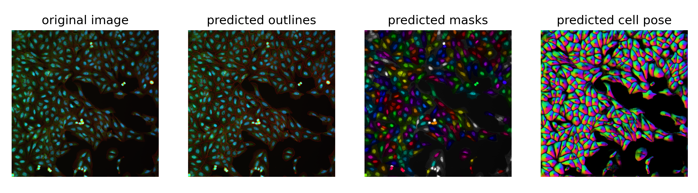
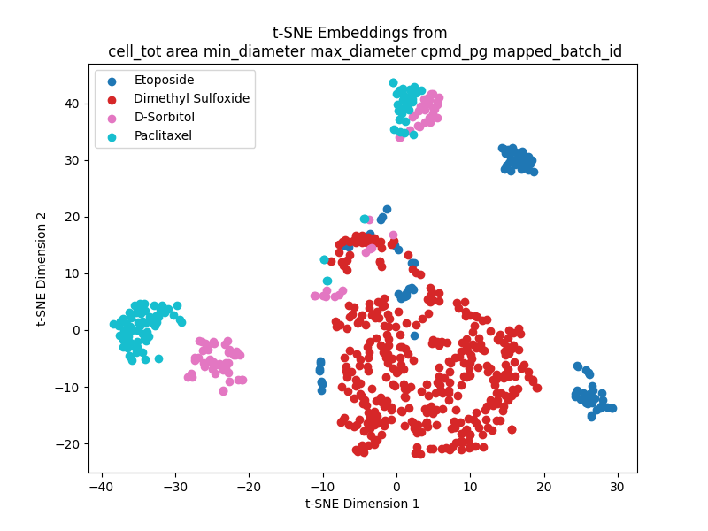

# Welcome to the SegMine project!

This project contains the skeleton of a pipeline for cell profiling.
It aims to perform the bioimage analysis task proposed by Phenaros, description can be found here: https://github.com/pharmbio/SegMine/tree/main

To set up the environment: 
pip install -r requirements_segmine.txt 

## Below are the pipeline steps 

### 1. PrepareDataForCellpose.ipynb 
This notebook combines images acquired at 3 wavelengths into rgb (405, 488 and 730 nm). The resulting images_rgb folder was then uploaded on google drive to be accessed for the next step.

### 2. Run_cellpose.ipynb
This notebook tunes the parameters of the cyto3 model on a subset of images before running the model on the entire folder. Illustration of the segmentations are stored in data/seg_plots folder. The resulting segmentation masks were then downloaded and set in a folder parallel to the source images.

### 3. ExtractMorphoPerImage.ipynb 
This notebook harvest the cells for morphometry metrics. The median  is more robust to outliers than the mean. The median of the metrics were calculated at each well-site combo over all cells, and are stored in the file:
median_morphometry_per_site.csv 
Due to poor image quality 1 combo (well G06 site 2) was excluded from the rest of the study.

### 4. DataAnalysis.ipynb
This notebook combines informations from plate_metadata.csv with the morphometry metrics. As the plate description were providing multiple references of well-site combo an assumption was made to select arbitrarily and consistently the more recent plate (because choosing a single reference felt less confusing than havine multiple ones).
From the gathered data a t-SNE is performed and the result displayed exhibits clusters corresponding to specific chemical components.

